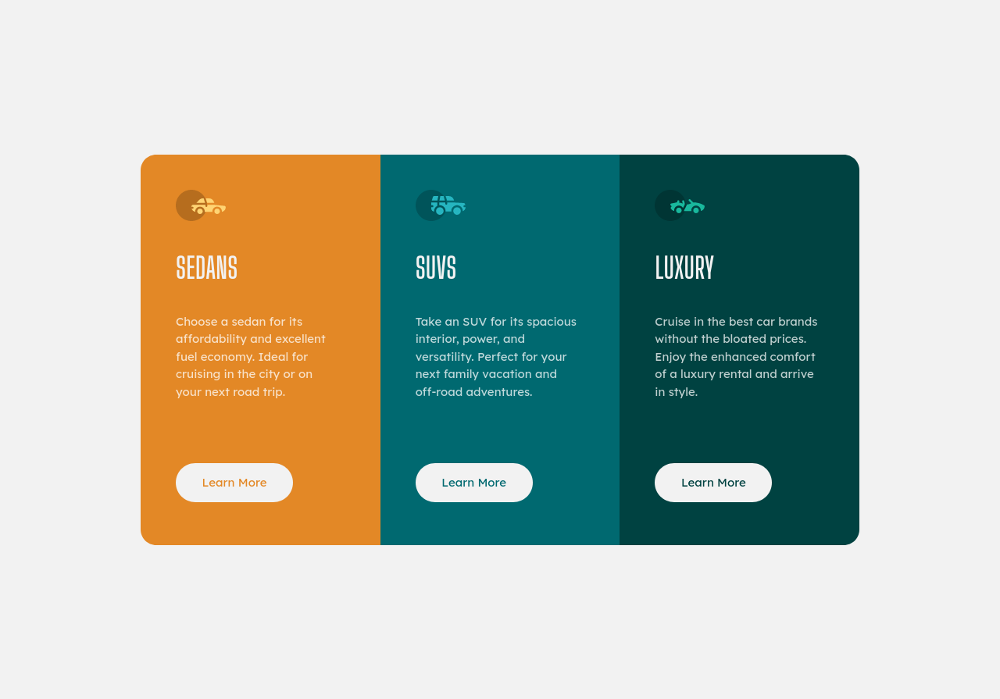

# Frontend Mentor - 3-column preview card component solution

This is a solution to the [3-column preview card component challenge on Frontend Mentor](https://www.frontendmentor.io/challenges/3column-preview-card-component-pH92eAR2-). Frontend Mentor challenges help you improve your coding skills by building realistic projects. 

## Table of contents

- [Overview](#overview)
  - [Screenshot](#screenshot)
  - [Links](#links)
- [My process](#my-process)
  - [Built with](#built-with)
  - [What I learned](#what-i-learned)
  - [Continued development](#continued-development)
  - [Useful resources](#useful-resources)
- [Author](#author)

## Overview

### Screenshot

### Links

- Solution URL: https://github.com/ThomasH2001/3-Column-Preview-Card-Component
- Live Site URL: https://thomash2001.github.io/3-Column-Preview-Card-Component/

## My process

### Built with

- Semantic HTML
- CSS media queries
- Flexbox

### What I learned

I learned about the section element, the orientation media query, and the flex item properties.

### Continued development

I would like to learn more about flexbox and semantic HTML.

### Useful resources

- [flex](https://developer.mozilla.org/en-US/docs/Web/CSS/flex)
- [HTML Semantic Elements](https://www.w3schools.com/html/html5_semantic_elements.asp)
- [orientation](https://developer.mozilla.org/en-US/docs/Web/CSS/@media/orientation)

## Author

- Frontend Mentor - [@ThomasH2001](https://www.frontendmentor.io/profile/ThomasH2001)
- Github - [@ThomasH2001](https://github.com/ThomasH2001/)
